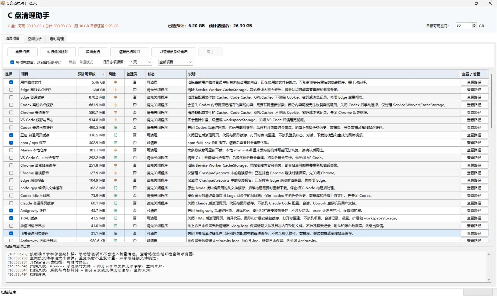
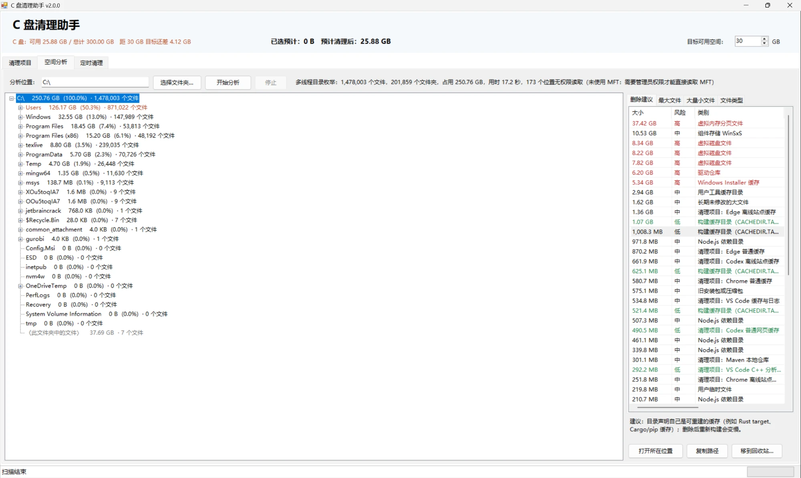
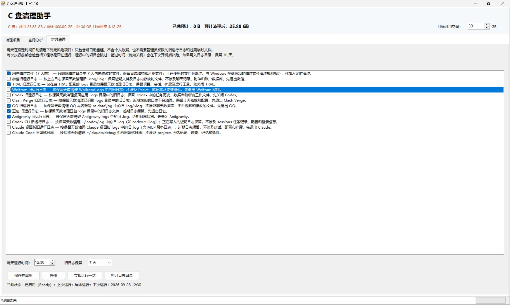

# C 盘清理助手

一个面向 Windows 11 的中文 C 盘清理工具。使用系统自带的 Windows PowerShell 5.1、WinForms 和 .NET，无需额外安装运行框架。

程序分三个页面：

- **清理项目**：按明确目录扫描并清理缓存、旧日志等，后台执行、可随时停止。
- **空间分析**：类似 WizTree，管理员模式下直接读取 NTFS 主文件表，数秒到十几秒分析整个 C 盘，找出大文件、大量小文件的文件夹，并给出删除建议。
- **定时清理**：每天自动清理完全无风险的项目（旧运行日志、7 天前的临时文件）。

## 截图

**清理项目**：按预计可释放空间排序，显示风险、是否需要管理员、运行状态和每项的清理范围。



**空间分析**：左侧为按占用排序的目录树，右侧为删除建议、最大文件、大量小文件和文件类型。截图为普通模式下的多线程枚举（约 148 万个文件用时 17 秒）；以管理员身份运行时会直接读取 MFT，速度更快。



**定时清理**：只列出无风险项目，可设置每天运行时间和日志保留天数，并显示计划任务状态。



## 运行

1. 在 [Releases](https://github.com/yhm138/c-drive-cleaner/releases) 下载最新的 `CDriveCleaner-vX.Y.Z.zip`（或下载本仓库 **Code → Download ZIP**），解压到本地。
2. 双击 `启动C盘清理助手.cmd`。它必须与 `CDriveCleaner.ps1` 位于同一目录。
3. 等待扫描结束，查看预计空间、状态、说明和具体路径，再勾选需要清理的项目。
4. 点击“清理已选项目”，确认清单后执行。需要管理员权限的项目可通过界面中的“以管理员身份重启”处理。

也可以在 Windows PowerShell 中启动：

```powershell
powershell.exe -NoProfile -ExecutionPolicy Bypass -STA -File .\CDriveCleaner.ps1
```

程序只处理 C 盘中明确列出的目录。已迁移到其他盘、未安装应用或不存在的目录不会算入 C 盘清理范围。部分应用的自定义存储位置需要在应用内管理。

## 功能

- **83 个项目**：61 个清理项目和 22 个管理入口，覆盖 QQ、豆包、TRAE、Codex、Claude、Antigravity、微信、腾讯会议、Teams、Visual Studio、TeX Live、WSL 等常用软件。
- **后台处理**：扫描、删除、清理后的重新扫描在独立任务中执行，提供进度和停止按钮。
- **按大小排序**：点击“预计可释放”表头切换升降序，直接比较原始字节数；“未知、未扫描、待重新扫描、仅管理”始终排在末尾。
- **日志保留期**：所有“旧运行日志”项目可选择保留最近 7 天或 30 天。
- **范围可见**：每项可查看实际目录和规则；列表可筛选清理项目或手动管理项目。
- **空间估算**：考虑压缩和稀疏文件，同一项目内的重复映射按文件标识去重。

### 清理项目

| 类别 | 示例 |
|---|---|
| 开发工具缓存 | pip、npm/npx、Cargo、rustup 下载与临时文件、NuGet、Gradle、Maven、Nuitka、node-gyp、VS Code C++ 分析缓存、Visual Studio 组件与设计器缓存、TeX Live LuaTeX 字体缓存、Java 部署缓存 |
| 编辑器与工具缓存 | VS Code、JetBrains、明确目录中的模型与工具缓存 |
| 浏览器缓存 | Chrome、Edge 普通缓存、离线站点缓存和崩溃报告 |
| 桌面应用缓存 | QQ、豆包、Codex、Claude、飞书、Microsoft Teams、Typora 普通网页缓存，阿里云盘缓存；TRAE、Antigravity 的网页/编译/图形/扩展安装包缓存；Codex、飞书离线站点缓存单独列出 |
| 旧运行日志 | QQ（含各账号 `nt_data\log`）、豆包、TRAE、Antigravity、Codex 桌面版与 CLI（`~/.codex/log`）、Claude 桌面版（含 MCP 日志）、Claude Code 调试日志（`~/.claude/debug`）、腾讯会议、OBS Studio、OpenCode、Clash for Windows、微信、Wolfram、Clash Verge |
| 系统相关 | 临时文件（全部或仅 7 天前）、用户级错误报告、崩溃转储、图形缓存、NVIDIA 下载缓存、当前用户 C 盘回收站、旧安装监控日志、关闭休眠 |

新增的应用缓存和日志项目默认不勾选。原有部分低风险项目会在扫描后默认选中；“勾选低风险项”会主动选择当前可用的低风险项目。请在确认窗口检查最终清单。

Windows 安装监控日志仅限 `Panther\monitor` 内 30 天前的 `.log`；安装、升级或等待重启时禁止处理。保留期根据最后修改时间计算，删除前会再次检查。VS Code、JetBrains 的综合缓存项目有自己的范围，不使用旧日志的保留开关。

应用项目只处理可自动重建的内容：Electron 的 `Cache`、`Code Cache`、`GPUCache`，VS Code 系编辑器的 `CachedData`、`CachedExtensionVSIXs`，以及日志目录中超过保留期的 `.log/.xlog`。聊天记录、对话、会话记录、生成内容和模型一律不在自动清理范围内。

### 管理入口

WSL 虚拟磁盘、iPhone/iPad 备份、TeX Live 安装、Visual Studio 安装包缓存、MySQL 数据与二进制日志、CapCut 资源缓存、微信开发者工具数据、QQ 聊天文件与缓存、豆包模型与生成内容、Codex 任务记录（sessions）、Claude Code 会话记录（projects、file-history）、Antigravity 对话与产出（`~/.gemini/antigravity` 中的 conversations、brain 等）、微信聊天文件、下载文件夹、微信更新包、NVIDIA App 更新资源、其他应用更新下载、Playwright 浏览器、剪映资源缓存、uv 缓存、Windows 存储设置、已安装应用。

这些项目显示“仅管理”，不能加入批量清理。点击“打开管理”可查看目录、操作建议或进入系统设置；目录总大小不会当成可释放空间。

## 空间分析（类似 WizTree）

“空间分析”页可以分析整个 C 盘或任意文件夹，只读取文件信息，不修改任何文件。

- **两种引擎**：以管理员身份运行并分析整个分区时，直接顺序读取 NTFS 主文件表（MFT），与 WizTree 原理相同，几十万到几百万个文件通常在数秒到十几秒内完成；普通模式或分析文件夹时使用多线程目录枚举。两种引擎都不跟随目录联接和符号链接，硬链接只计一次。
- **目录树**：按实际占用从大到小展开，显示占上级的百分比和文件数；占上级 20% 以上的文件夹以橙色标出。
- **最大文件**：列出占用最大的 1000 个文件，含大小、实际占用、修改时间。
- **大量小文件**：找出文件数 ≥ 5000、平均大小 ≤ 128 KB 的文件夹（如 `node_modules`、缓存、日志碎片），只报告最具体的那一层，不重复列出上级。
- **文件类型**：按扩展名汇总占用。
- **删除建议**：结合已知位置和文件特征给出建议，每条都标注风险和处理方式：
  - Windows 更新缓存、传递优化文件、以前的 Windows 安装、升级临时文件、错误报告、内存转储 → 指向“存储设置”；
  - WinSxS、Installer、DriverStore、分页文件 → 明确提示**不要手动删除**以及正确的系统工具；
  - 回收站、临时文件、崩溃转储、休眠文件、Gradle/Maven/Cargo 等 → 指向“清理项目”中对应的受保护项目，可一键转到；
  - `node_modules`、声明了 `CACHEDIR.TAG` 的构建缓存（如 Rust `target`）、Python 虚拟环境；
  - 超大 `.dmp` / `.log`、下载超过 30 天的安装包与压缩包、`.tmp/.bak`、半年未修改的 1 GB 以上大文件；
  - WSL / Docker / 虚拟机磁盘 → 提示用对应工具压缩，不要直接删除。
- **操作**：打开所在位置、复制路径、导出文本报告；可删除的条目只提供“移到回收站”，执行前再次确认。Windows、Program Files、用户根目录、下载/文档等根文件夹以及系统文件始终受保护，不提供删除。

命令行也可以输出分析报告：

```powershell
powershell.exe -NoProfile -ExecutionPolicy Bypass -File .\CDriveCleaner.ps1 -AnalyzeOnly -AnalyzeRoot C:\
```

## 定时清理

“定时清理”页可以创建一个 Windows 计划任务，每天在指定时间自动清理**完全无风险**的项目：

- 只列出同时满足以下条件的项目：低风险、只含可自动重建的内容、不涉及个人数据、不需要管理员权限，并且有保留期保护（旧运行日志按 7/30 天保留，临时文件只删除 7 天前的）。
- 每次执行前都会检查相关程序是否正在运行，运行中的项目会跳过；即使配置文件被改动，不在白名单中的项目也不会执行。
- 计划任务以当前用户、普通权限运行（不提权）；错过时间会在开机后补跑。
- 启用时会把脚本复制到 `%LOCALAPPDATA%\CDriveCleaner\`，移动或删除下载的文件夹不会影响任务。配置保存在同一目录的 `schedule.json`，每日日志在 `logs\`，保留 30 天。
- 可随时“立即运行一次”或“停用”；停用会删除计划任务。

## 清理行为

清理会永久删除选中的缓存或文件；离线缓存清理后需联网重新加载，构建缓存清理后可能重新下载资源。Maven 本地安装但未发布的构件可能无法重新下载，选择前请查看项目说明。

相关应用运行时，对应清理项目会被禁用。执行前和进入每个目录前会复查运行状态，清理期间请保持应用关闭。路径会做允许范围检查，目录联接和符号链接不跟随，共享硬链接文件保守跳过。管理员重启使用不同账户时，用户级项目会禁用。

空间显示是估算，文件占用、应用重新写入和文件系统分配都会影响实际释放量。无法读取的项目会标为未知或提示管理员扫描。

“停止”在当前文件操作返回后生效，已完成的删除不会撤销。回收站清空、关闭休眠等系统操作需要等待当前整项返回。任务中关闭窗口会先请求停止，后台退出后再关闭窗口。停止清理后请重新扫描。

## 开发与验证

主程序为单个可直接运行的脚本，所需 Windows 文件信息接口代码内嵌在脚本中，不需要构建步骤。开发时直接修改根目录 `CDriveCleaner.ps1`。

在 Windows PowerShell 5.1 中运行：

```powershell
# 清理规则、目录边界、文件属性和后台工作测试
powershell.exe -NoProfile -ExecutionPolicy Bypass -STA -File .\tests\Test-Cleanup.ps1

# 空间分析（多线程枚举；管理员下另测 MFT 直读）、应用项目、定时清理
# -IncludeTaskRegistration 会真实创建并删除计划任务，只在 CI 等一次性环境使用
powershell.exe -NoProfile -ExecutionPolicy Bypass -STA -File .\tests\Test-Analyzer.ps1

# 实际 WinForms 表格的数值排序测试
powershell.exe -NoProfile -ExecutionPolicy Bypass -STA -File .\tests\Test-SizeSort.ps1

# 仅构造界面，不执行扫描或清理
powershell.exe -NoProfile -ExecutionPolicy Bypass -STA -File .\CDriveCleaner.ps1 -UiSmokeTest

# 打包可直接运行的三个文件
powershell.exe -NoProfile -ExecutionPolicy Bypass -File .\scripts\Build-Release.ps1
```

清理测试只删除自身创建的合成夹具，不会清理真实用户缓存；目录发现测试会只读检查本机的应用目录。夹具位于 C 盘临时目录，测试需要 C 盘上的用户临时目录和 Windows PowerShell 5.1。结果保存在 `tests/TestResults/`，不提交到仓库。

排序测试覆盖不同单位、相同显示文字的不同字节值、64 位数值、无大小项目位置、升降序、勾选状态和行身份。清理测试覆盖保留期、类型限制、文件更新后复查、进程与权限保护、目录边界、链接、压缩/稀疏文件和后台取消。

打包结果位于 `dist/CDriveCleaner.zip`。仓库不包含本机磁盘盘点、缓存清单、真实目录大小、测试输出或个人配置。
